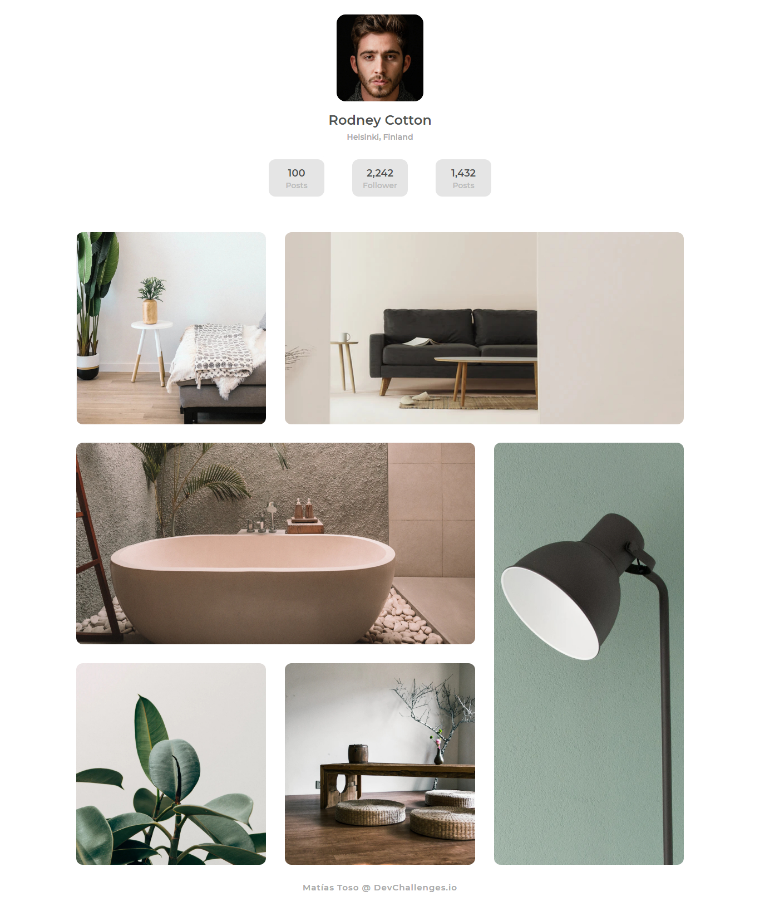

<!-- Please update value in the {}  -->

<h1 align="center">My Gallery Challenge</h1>

   Solution for a challenge from  <a href="http://devchallenges.io" target="_blank">Devchallenges.io</a>.

  <h3>
    <a href="https://responsive-gallery-layout.netlify.app/">
      Demo
    </a>
     | 
    <a href="https://devchallenges.io/solutions/q7mbQkXspuswmpNPbmgS">
      Solution
    </a>
     | 
    <a href="https://devchallenges.io/challenges/gcbWLxG6wdennelX7b8I">
      Challenge
    </a>
  </h3>

<!-- TABLE OF CONTENTS -->

## Table of Contents

- [Overview](#overview)
- [Built With](#built-with)
- [Contact](#contact)

<!-- OVERVIEW -->

## Overview

In the screenshot you can see the final rusult. Here is the [demo](https://devchallenges.io/solutions/q7mbQkXspuswmpNPbmgS). This was my first proyect from [DevChallenge](https://devchallenges.io/). I enjoy while I was building it and I learned some things. For example, I had some problems with the picture of a lamp but I used Photoshop to fix it. Also I improved my CSS skills because I used CSS grid and CSS flexbox.

### Built With

<!-- This section should list any major frameworks that you built your project using. Here are a few examples.-->

- HTML
- Grid
- Flexbox

## Contact

- Website [Portfolio](https://matiastoso.github.io/)
- GitHub [@matiastoso](https://github.com/matiastoso/)
- Instagram [@matiastoso](https://www.instagram.com/matiastoso/)
